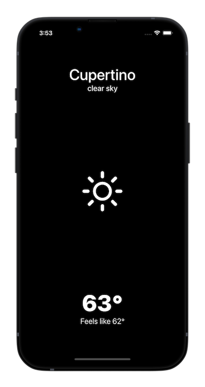

<div align="center">
    <h1>Frosti</h1>
    <i>A simple weather app based on SwiftUI</i>
</div>

<br />

<div align="center">
    <sup>Information</sup>
    <br />
    
    
</div>

---

## Key Features
- Vanilla SwiftUI + Combine + MVVM
- No external dependencies
- Core location
- OpenWeather API

## Screenshot


## Getting Started

### Prerequisites

### Installation
1. Clone or download the project to your local machine
2. Open and replace `<YOUR API KEY>` with your OpenWeather API key in `Endpoint+Weather.swift`

```swift
extension Endpoint {
    struct Weather: EndpointProtocol {

    ...
    private static let newsApiKey = "<YOUR API KEY HERE>"
    ...
```

## To-Do
- [ ] Ability to add more locations.
- [ ] Implement test cases

## Licence
Frosti is released under the MIT license. See [LICENSE](./LICENSE) for details.
